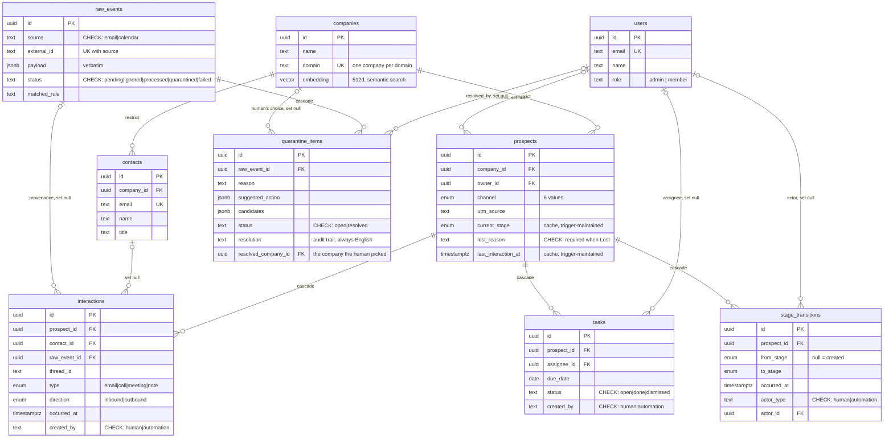

# YunoCRM

A CRM that fills itself from a raw event feed. Emails and calendar events are
ingested verbatim, classified by rules, resolved into companies, prospects,
contacts and stage history, and whatever the rules cannot decide goes to a
human review queue instead of being guessed at or dropped.

Built for the Yuno take-home. Stack: Next.js 16 (App Router, React 19) ·
Postgres via Supabase · Drizzle ORM · Tailwind 4 · Vitest · Recharts ·
Framer Motion · next-intl. Deployed at
[yuno-crm.vercel.app](https://yuno-crm.vercel.app).

## Contents

- [Quick start](#quick-start)
- [Keyboard shortcuts](#keyboard-shortcuts)
- [Running the tests](#running-the-tests)
- [Data model](#data-model)
- [Ingestion pipeline](#ingestion-pipeline)
- [Automations](#automations)
- [Where AI is used, and where it deliberately is not](#where-ai-is-used-and-where-it-deliberately-is-not)
- [Designing the real Gmail/Calendar integration](#designing-the-real-gmailcalendar-integration)
- [What I would do with more time](#what-i-would-do-with-more-time)
- [What I cut, and known limitations](#what-i-cut-and-known-limitations)

## Quick start

Prerequisites: Node 20+ (developed on 24.18) and a free Supabase project.
Nothing else is needed — no Docker, no local Postgres.

**1. Clone and install**

```bash
git clone https://github.com/aicezhe/YunoCRM.git
cd YunoCRM
npm install
```

**2. Configure**

```bash
cp .env.example .env.local
```

Fill it in. Every value comes from one Supabase project:

| Variable | Where it comes from | Required |
| --- | --- | --- |
| `DATABASE_URL` | Settings → Database → Connection string (URI, port 5432) | yes |
| `NEXT_PUBLIC_SUPABASE_URL` | Settings → API → Project URL | yes |
| `NEXT_PUBLIC_SUPABASE_ANON_KEY` | Settings → API → anon public | yes |
| `SUPABASE_SERVICE_ROLE_KEY` | Settings → API → service_role (server-only) | yes — creates auth accounts |
| `VOYAGE_API_KEY` | [dash.voyageai.com](https://dash.voyageai.com) | no — semantic search degrades gracefully |
| `ANTHROPIC_API_KEY` | [console.anthropic.com](https://console.anthropic.com) | no — quarantine AI tier is skipped |

**3. Create the schema**

```bash
npx supabase login
npx supabase link --project-ref YOUR_PROJECT_REF
npx supabase db push
```

Ten migrations in `supabase/migrations/` create nine tables, four enums, the
CHECK constraints, two triggers, the indexes, and the `pg_trgm` / `vector`
extensions.

**4. Load the dataset**

The fixture ships with the repo at `data/yuno-crm-seed-data.json`
(360 emails, 181 calendar events). Run in this order — each script is
idempotent and safe to re-run:

```bash
npm run ingest            # JSON -> raw_events, stored verbatim
npm run classify          # rules decide: processed / ignored / quarantined
npm run resolve           # -> companies, contacts, prospects, interactions, stage history, tasks
npm run enrich            # resolution suggestions for quarantined items
npm run embed-companies   # optional: needs VOYAGE_API_KEY, powers semantic search
npm run seed-users        # auth accounts + roles; prints the logins below
```

**5. Run**

```bash
npm run dev
```

Open <http://localhost:3000>. Five seeded accounts share one password:

| Email | Role |
| --- | --- |
| `giulia@yunoai.io` | admin |
| `marco@yunoai.io` | admin |
| `admin@yunoai.io` | admin |
| `sara@yunoai.io` | member |
| `luca@yunoai.io` | member |

Password: `YunoCRM2026!` — a fixture, not a credential scheme.
`seed-users` upserts by email, so re-running it also restores roles that
were changed through the UI.

What a clean run produces, verified against the database:

| | |
| --- | --- |
| raw_events | 538 (357 email + 181 calendar) — 3 fewer than the 541 in the JSON, see duplicates below |
| classified | 389 processed · 149 ignored · 5 quarantined for review |
| companies / prospects / contacts | 76 / 76 / 88 |
| interactions / stage_transitions | 396 / 259 |
| auto-created follow-up tasks | 40 |

## Keyboard shortcuts

The app is opened every morning by the same few people, so the fast paths are
built for the second month of use rather than the first.

| Shortcut | Does |
| --- | --- |
| `Shift`+`1` | Dashboard |
| `Shift`+`2` | Search |
| `Shift`+`3` | Quarantine |
| `Shift`+`4` | Team — admins only; for a member there is no fourth section and the key does nothing |
| `⌘`+`Shift`+`F` | On the search screen: list every company without typing a query |

Three implementation details that are not obvious:

- The numbers come from the same `NAV_ITEMS` array the sidebar renders from,
  so a shortcut cannot drift out of sync with the visible order, and the
  admin-only rule is applied once rather than duplicated.
- Matching is on `event.code` (`Digit1`), not `event.key`. `Shift`+`1` only
  produces `!` on some layouts — with a Russian or Italian keyboard, `key`
  would be something else entirely while `code` stays `Digit1`. The app ships
  in three languages; assuming a US layout would have quietly broken it for
  two of them.
- Nothing fires while focus is in an input, textarea, select or
  contenteditable. Without that guard, typing `!` into the search box would
  navigate away mid-query. `Cmd`/`Ctrl`+digit is also left alone, since that
  is the browser's own tab switcher.

The sidebar shows each number on hover — discoverable when you go looking,
invisible when you are not.

## Running the tests

```bash
npm test          # 92 unit tests — pure logic, no database, no network
npm run test:db   # 16 integration tests — needs DATABASE_URL and the loaded fixture
npx tsc --noEmit  # types
npm run build     # production build
```

The split is deliberate. `npm test` stays fast and secret-free so it works as
a tight loop and in CI:

| File | Tests | What it pins down |
| --- | --- | --- |
| `scripts/classification-rules.test.ts` | 21 | Each rule in isolation, plus **priority order** — the tests assert that `website_lead` (priority 2) beats `internal_email` (6), which is the trap described below |
| `scripts/resolution-rules.test.ts` | 9 | Channel attribution, stage signals from email and calendar, canonical lost reasons, reschedule vs cancellation |
| `scripts/embedding-rules.test.ts` | 11 | The text handed to the embedding model |
| `src/app/(app)/users/user-rules.test.ts` | 13 | Authorization: a member cannot promote themselves, the last admin cannot be demoted, and an unauthorized caller is refused *before* existence is checked so error text can't be used to probe real user ids |
| `relative-time`, `format-days`, `typewriter-core`, `particle-field-core` | 38 | Display logic where locales genuinely differ (Russian three-form plurals, the fractional-genitive rule) and pure animation maths |

The dashboard numbers can't be unit-tested honestly, because they *are* SQL —
reimplementing those aggregates in TypeScript would only prove the copy
agrees with itself. `npm run test:db` re-derives every figure a **different**
way against the same database (a lateral ordered lookup where the shipped
query uses a window function, separate counts where it uses filters) and
compares.

That suite paid for itself on its first run: it caught the stage-duration
window ordering by `occurred_at` alone. 39 prospects have two transitions
sharing a timestamp (one inbound email both creates a website lead and counts
as first contact), and without a tiebreaker their order is unspecified — so
whichever sorted second absorbed the next stage's duration. Both queries now
order by `(occurred_at, to_stage)`; `funnel_stage` is a Postgres enum, so it
sorts in declared funnel order and reconstructs the intended chain. The
displayed averages did not change, because Postgres happened to return the
rows in the right order. That was luck, not a guarantee.

Idempotency is verified by re-running the pipeline: a second `npm run ingest`
reports `processed 541, inserted 0, skipped 541`, and a second `npm run
resolve` creates 0 companies, 0 prospects and 0 interactions.

That second check earned its place. It used to be false: quarantine
resolutions leave their raw event `processed`, so the resolver picked them up
again and matched the company by **sender domain** — the one inference those
records exist to avoid. On this data it created a company literally named
`libero.it` and moved two interactions onto it, one of which a human had
explicitly linked to `Autotrasporti Fumagalli`. A re-run silently overruled
two human decisions. `quarantine_items.resolved_company_id` now records which
company the person picked and the resolver uses it instead of guessing.

## Data model



**Why each table exists, and the decision behind it.**

- **`companies` / `prospects` are separate.** A company is a legal entity that
  exists once; a prospect is one sales attempt at it. The same company can
  come back through a different channel next quarter, and that has to be a
  second prospect with its own funnel, owner and history — not an overwrite of
  the first. Channel, stage and owner therefore live on `prospects`, not on
  `companies`. `companies.domain` is UNIQUE, which is what lets the resolver
  match an incoming sender domain to an existing company deterministically.

- **`stage_transitions` is the source of truth; `current_stage` is a cache.**
  Every stage change is a row recording from, to, when, by whom and whether a
  human or the automation did it. `prospects.current_stage` exists only so the
  dashboard doesn't recompute history on every query — and it is maintained by
  a **database trigger** on insert into `stage_transitions`, not by application
  code, so no write path can forget to update it. Same pattern for
  `last_interaction_at`, whose trigger only ever moves the timestamp *forward*,
  so a late-arriving old email cannot rewind it.

- **Integrity is enforced by the database, not by the app.** `lost_requires_reason`
  makes a Lost prospect without a reason unrepresentable. `actor_type`,
  `created_by` and every `status` are CHECK-constrained. `contacts.email` and
  `companies.domain` are UNIQUE. And `raw_events (source, external_id)` is
  UNIQUE — that one line is what makes the whole pipeline idempotent and
  replay-safe. It is not theoretical: the provided dataset contains **3 emails
  with duplicate `message_id`s**, and the constraint collapsed them silently
  (360 rows in the JSON, 357 in the table).

- **Deletes are deliberate, per relationship.** A company with prospects cannot
  be deleted (`restrict`) — losing pipeline by deleting an account is not an
  accident worth allowing. Deleting a prospect takes its interactions, history
  and tasks with it (`cascade`). Deleting a user never destroys the records
  they touched (`set null`) — the stage history stays, it just loses the actor.

- **`raw_events` keeps the payload verbatim** and is append-only. Rules change;
  the record of what actually arrived should not. Any reclassification is a
  re-run over the same rows, not a re-import.

- **`quarantine_items`** is the human-review queue, one row per raw event the
  rules could not resolve, carrying the reason and machine-generated
  suggestions. Its `resolution` text is stored in English regardless of the
  UI language — an audit trail should not depend on which locale someone
  happened to be using. `resolved_company_id` is the machine-readable half of
  the same decision: the resolver reads it instead of inferring a company from
  the sender domain, so re-running the pipeline can never overrule a person.

- **`tasks`** carries automation output that needs a human ("no reply in 7
  days"), with `created_by` distinguishing it from anything a person adds.

- **Every index is tied to a named query**, documented inline in
  `supabase/migrations/20260727200006_indexes.sql`: `current_stage` for the
  by-stage dashboard, `last_interaction_at` for the withering range scan,
  `(prospect_id, occurred_at)` for the timelines, `raw_events.status` for
  fetching the next ingest batch, `(assignee_id, status)` for "my open tasks",
  plus a GIN trigram index on `companies.name` for search. At the brief's
  reference scale — tens of thousands of prospects, hundreds of thousands of
  interactions — these are the hot paths, and each is an index scan rather
  than a sequential one.

- **No RLS.** All database access goes through the Next.js server over
  `DATABASE_URL`; the browser only ever talks to Supabase Auth. Authorization
  is enforced server-side twice: middleware gates the routes, and the
  admin-only server actions re-check the caller's role themselves — a page
  redirect alone would not stop a member from POSTing to the action endpoint
  directly. RLS would earn its keep the day the browser gets a direct database
  connection; it doesn't have one.

## Ingestion pipeline

```
data/yuno-crm-seed-data.json
        │  ingest — verbatim, UNIQUE(source, external_id)
        ▼
   raw_events ──── classify ────┬── ignored     149  (noise: internal, bulk, auto-reply, recruiting)
   (538 rows)   first match wins ├── processed   389 ──── resolve ──▶ companies · prospects
                                 │                                     contacts · interactions
                                 └── quarantined   5 ──── enrich ──▶ human review queue
```

### The central decision: content over sender

The obvious way to filter a company's own inbox is by sender — drop anything
from `@yunoai.io`, keep the rest. On this dataset that rule destroys the most
valuable records in the file.

28 emails arrive from the company's own domain. Twenty of them are from
`noreply@yunoai.io` and are **website lead notifications** — a structured
template carrying `Nome:`, `Email:`, `Azienda:`, `Messaggio:`, `UTM source:`.
They are not internal chatter; they are the only record of twenty inbound
leads, and they are the entire `website` channel. The remaining 8 are genuine
internal mail between Giulia and Marco.

So classification keys on **what the message contains**, not who sent it. The
`website_lead` rule sits at priority 2, above `internal_email` at priority 6,
and matches the body template. A sender-based rule would have discarded 20 of
those 28 emails — 71% of what it filtered would have been real pipeline.

Two tests in `classification-rules.test.ts` exist specifically to keep that
ordering from being "tidied up" by a future edit: one asserts a
`noreply@yunoai.io` lead notification classifies as `website_lead`, another
asserts internal mail between two employees still classifies as
`internal_email`.

### Rules, in priority order — first match wins

| # | Rule | Outcome | Signal | Matched |
| --- | --- | --- | --- | --- |
| 1 | `duplicate` | ignored | Already-seen `(source, external_id)` | 0 — the UNIQUE constraint gets there first; kept as a documented no-op |
| 2 | `website_lead` | processed | Structured lead template in the body | 20 |
| 3 | `auto_reply` | ignored | Subject starts `Risposta automatica:` | 6 |
| 4 | `external_bulk` | ignored | `noreply`/`newsletter`/`events`/`billing`/`notifications` local part | 27 |
| 5 | `recruiting` | ignored | Careers/hiring role accounts | 3 |
| 6 | `internal_email` | ignored | Both sender and all recipients are `@yunoai.io` | 8 |
| 7 | `internal_event` | ignored | Calendar event with no external attendee | 96 |
| 8 | `cancelled_event` | ignored | Cancelled event; a later same-company Demo/Check-in makes it a **reschedule**, not a drop | 7 |
| 9 | `known_contact` | processed | Sender matches an existing contact | 0 on a cold run |
| 10 | `known_domain` | processed | Sender domain matches an existing company | 0 on a cold run |
| 11 | `personal_domain` | quarantined | gmail / libero / outlook — a person, not a company | 4 |
| 12 | `default_processed` | processed | Reached here ⇒ not noise ⇒ legitimate correspondence | 366 |
| 13 | `unresolved` | quarantined | Genuinely undecidable | 1 |

Note on #4 vs #2: `noreply@` *is* in the bulk list, and would have caught the
lead notifications — priority is what saves them. Rule order here is load-bearing,
which is why it is asserted by tests rather than left to reading order.

Note on #12: rules 9 and 10 can only fire once companies and contacts exist,
so on a first run against an empty database every legitimate external email
would fall through to `unresolved` and flood the review queue. `default_processed`
exists so that quarantine stays a genuine exception rather than the default
destination.

### Three outcomes, and why quarantine is not a dumping ground

**Ignored** is a decision, not a deletion — the row stays in `raw_events` with
the rule that matched it, so any filtering choice can be audited or reversed
by re-running classification.

**Processed** goes to the resolver, which creates or matches the company by
domain, creates contacts, opens a prospect, writes interactions and stage
transitions.

**Quarantined** means the automation refused to guess. On this dataset that is
5 records out of 538 — under 1%. That ratio is the point: a review queue that
receives a third of the traffic is just a second inbox and gets ignored. Every
quarantined item arrives with the reason, a suggested action and candidate
companies, so the human decision is a click (create / link to existing /
discard), not an investigation. In the deployed demo all 5 have since been
resolved that way, so the queue reads empty and the screen's **Resolved** tab
shows the trail instead — what was decided, by whom, when. A fresh run leaves
all five open.

The `personal_domain` case is the interesting one. An email from
`cristina.ricci@libero.it` cannot be attributed by domain — `libero.it` is a
consumer mailbox, not a company. Guessing would silently corrupt the pipeline;
dropping would lose a real lead. So it goes to a human, with fuzzy-matched
company candidates attached.

## Automations

All three run inside `npm run resolve` and are marked
`actor_type = 'automation'` / `created_by = 'automation'` so machine actions
are always distinguishable from human ones in the history.

- **Stage advancement from signals.** Email bodies and calendar events carry
  stage signals — a demo booked, a trial started, a contract sent, an
  explicit loss. Each produces a `stage_transitions` row; the trigger updates
  the cached `current_stage`. 259 transitions were derived this way.
  Terminal-stage rules are enforced by the schema: a prospect moved to `Lost`
  without a canonical reason violates a CHECK constraint.

- **Reschedule detection.** A cancelled calendar event is *not* a lost deal if
  the same company has a later Demo or Check-in on the calendar. Seven
  cancellations were correctly read as reschedules and left the stage
  untouched, instead of pushing seven live deals to Lost.

- **Follow-up tasks.** A prospect with no reply for 7 days gets an open task
  assigned to the Yuno employee on the thread — 40 were created. Re-running
  the resolver does not duplicate them: it keys on
  `(prospect_id, "no reply in 7 days")`.

## Where AI is used, and where it deliberately is not

**Not used: classification.** Every routing decision in the table above is a
deterministic rule. This is the single most consequential choice in the
project, and it is not a cost decision:

- **Determinism.** The same email must classify the same way every time. An
  LLM that reclassifies `noreply@yunoai.io` differently on Tuesday silently
  reshapes the funnel and nobody notices until the numbers are wrong.
- **Testability.** Rules can be asserted. `classification-rules.test.ts` runs
  21 assertions against real rows from the fixture in 71 ms with no network. A
  prompt cannot be pinned that way.
- **Auditability.** `raw_events.matched_rule` records *which* rule decided,
  by name. "Why was this email ignored?" has an exact answer. "The model
  decided" is not an answer a sales team can act on.

The rules are also the cheap path: classification is local — no API call, no
rate limit, no per-record cost, and no failure mode that can leave half the
inbox unclassified.

**Used: quarantine suggestions**, in two tiers, and only *after* the rules have
already admitted they can't decide.

1. **`pg_trgm` word similarity** against `companies.name`, run in Postgres. If
   a confident match exists, candidates are attached and the item never
   reaches the AI. Database-native, free, deterministic.
2. **Claude Haiku (`claude-haiku-4-5`)** for what tier 1 could not match —
   reading the email body to propose a company name and action.

This layer is **strictly additive**: it writes only to
`quarantine_items.suggested_action` and `.candidates`. If `ANTHROPIC_API_KEY`
is absent the script logs that tier 2 is disabled and applies tier 1 only; if
the API fails mid-run, items are left bare. Nothing downstream depends on it,
and the AI never decides — a human still clicks create / link / discard.

**Used: semantic search.** Company records are embedded with Voyage
(`voyage-3-lite`, 512 dimensions) into `companies.embedding`, and search
compares the query embedding by cosine distance. This is what lets the Russian
query *винодельня* find the Italian company *Vini Colline Toscane* — scoring
0.566 against 0.369 for the next-closest company. Without `VOYAGE_API_KEY` the
screen says so and exact matching keeps working.

One deliberate absence here: the vector index. An IVFFlat index on
`companies.embedding` was created and then **dropped** (migration
`20260730090000`). At 76 rows with `lists = 100`, most k-means cells are empty
and a query whose nearest centroid owns an empty cell matches *nothing* —
measured, with `enable_seqscan = off` to force it: 20 of 20 random query
vectors returned 0 rows. A sequential scan over 76 rows is both exact and
faster. The index earns its place at tens of thousands of rows, sized from a
real row count and verified against exact results.

## Designing the real Gmail/Calendar integration

The pipeline was shaped so that swapping the fixture for live sources changes
the **feeder**, not the model. `ingest.ts` is the only file that knows the JSON
shape; everything downstream consumes `raw_events`. A Gmail adapter that writes
the same rows is a drop-in replacement — classification, resolution,
quarantine and the UI do not change.

**OAuth and scopes.** Per-workspace OAuth with `gmail.readonly` and
`calendar.events.readonly` — read-only, because nothing in this product needs
to send on a user's behalf. Refresh tokens live server-side only, encrypted at
rest, one grant per connected mailbox. Nothing touches the browser.

**Incremental sync, not full scans.**
- *Gmail*: `users.watch` registers a Pub/Sub push channel; each notification
  carries a `historyId`. The worker calls `history.list` from the last stored
  cursor, fetches each new message id, and writes one `raw_events` row with
  `external_id = ` the Gmail message id.
- *Calendar*: `events.watch` channels plus incremental `syncToken`s.
  `external_id` is the event id *plus a version discriminator*, so a
  reschedule arrives as a new row rather than silently mutating the old one —
  which matters, because the reschedule-vs-cancellation rule needs both events
  to be visible.

**Webhook plus polling, deliberately.** Push is an optimization; polling is the
guarantee. Watch channels expire (~7 days for Gmail) and Pub/Sub can drop
messages. A scheduled poll using the same cursors produces identical rows, and
because ingestion is idempotent the overlap costs nothing. This is not
belt-and-braces — a lead lost to an expired watch channel is invisible until
someone asks why the pipeline went quiet.

**Duplicates are already solved.** `UNIQUE(source, external_id)` plus
`onConflictDoNothing` means a webhook delivered twice, a replayed batch, or a
backfill overlapping live traffic all insert exactly once. This is not
speculative: the provided fixture already contains 3 duplicate `message_id`s
and the constraint handled them.

**Errors and retries.** `raw_events.status` is a state machine:
`pending → processed | ignored | quarantined | failed`. A transient failure
(API 5xx, rate limit, timeout) marks `failed`, which is retryable by re-running
the classifier — the payload is already stored, so retrying costs no API call.
Permanent failures stay `failed` with the error recorded, visible rather than
swallowed. Gmail rate limits are handled by exponential backoff on the fetch
side, before anything is written.

**LLM parsing for unstructured mail.** The fixture's website leads use a fixed
template that a regex parses reliably. Real inboxes do not cooperate: the same
lead arrives as prose, in Italian or English, with the company name in a
signature. The design is to keep the deterministic parser as the fast path,
and fall back to an LLM extraction pass — structured output (company, contact
name, intent, requested action) with a confidence score — only when the
template does not match. Two rules make that safe: the LLM's output is a
*proposal*, written to `quarantine_items.suggested_action` rather than applied,
and anything below a confidence threshold goes to a human. Extraction is
already the place where a model earns its keep; routing is not.

**Where the human sits.** Quarantine is not a design sketch — it is a working
prototype of exactly this loop, running today on the `personal_domain` and
`unresolved` cases. Anything the automation cannot decide with confidence
lands in a queue with the reason, machine-generated candidates and three
one-click resolutions, and the outcome is written back to the audit trail with
who resolved it and when. The volume discipline carries over: at under 1% of
traffic the queue is a real workflow. If a live feed pushed that past a few
percent, the correct response is to fix the rules, not to grow the queue.

## What I would do with more time

- **Predictive churn instead of a fixed threshold.** "Cold after 14 days"
  is a blunt instrument: it treats a 3-day-old enterprise negotiation and a
  3-day-old inbound lead identically. With enough closed-won/closed-lost
  history the honest version is a model that estimates *probability of loss*
  from the features already in the schema — stage, channel, time in stage,
  interaction cadence, direction ratio — and ranks the pipeline by expected
  value at risk rather than by days elapsed. Thresholds would then be
  per-segment rather than global, because a 14-day silence means something
  very different for `website` than for `linkedin_outbound`.
- **A cross-company task list.** Follow-up tasks are created (40 of them) and
  are shown in context — on the company page and in the search overlay, with
  title, due date and assignee. What is missing is the other view of the same
  rows: one "my open tasks" screen spanning every company. The brief asks for
  the tasks to be *created*, not for that screen, so this is an addition
  rather than a gap — and the model is ready for it, since
  `idx_tasks_assignee_status` on `(assignee_id, status)` exists for exactly
  that query.
- **Ingestion as a service, not a script.** The pipeline is six idempotent CLI
  scripts. For production it needs to be a queue-backed worker with retries and
  a dead-letter path, which is a runtime change — the state machine in
  `raw_events.status` is already the right shape for it.
- **Test the SQL against a fixture database.** `npm run test:db` currently runs
  against the same database the app uses. The right version spins up a
  disposable Postgres, loads a small hand-built fixture with the edge cases
  written on purpose, and runs there — so the tests are hermetic and can assert
  on exact numbers rather than on cross-derivations.
- **Realtime.** Supabase Realtime on `quarantine_items` would keep the review
  queue live across users; today two people can pick up the same item.

## What I cut, and known limitations

- **Ownership graph — cut for lack of honest data.** The brief hints at
  understanding who owns which relationship. The dataset carries only who
  appears on a thread, which is not the same thing: the person who sends the
  most email to an account may be doing the least valuable work on it. Building
  a confident-looking ownership view on that signal would have been the most
  visually impressive thing in this project and the least true, so
  `prospects.owner_id` records the assignee and nothing extrapolates from it.
- **Manual prospect and stage editing.** Records enter through the pipeline or
  through quarantine resolution; there is no "create prospect" form. This
  matches the product thesis — a CRM that fills itself — but a real deployment
  would need it. `stage_transitions.actor_type = 'human'` is already there
  waiting for it.
- **The segment drawer caps at 200 rows** and says so in its footer rather than
  paginating.
- **The dataset is static, and the withering screen shows it.** The fixture
  ends 9 July 2026. Measured against today's date, every prospect reads as
  cold — so "cold", "days per stage" and stage timings are all anchored to the
  newest event *in the data*, not the wall clock, and the anchor date is
  printed under the dashboard greeting. This is a property of a frozen
  fixture, not a logic flaw. The one place that intentionally uses the real
  clock is the Recent Activity feed, which answers "what happened lately" and
  would be lying if it called a three-week-old event "now".
- **54 of 57 open prospects are flagged as withering, and that is correct.**
  The 393 seeded interactions spread fairly evenly across six months with only
  16 in the final fortnight, so a 14-day window covers about 8% of the history.
  At an even spread you would expect 4–5 prospects to still count as warm;
  there are 3. The threshold comes from the brief and was left alone rather
  than tuned to produce a friendlier screenshot.
- **The UI ships in English, Italian and Russian.** Beyond the brief, added as
  a production-readiness demonstration — and it surfaced real bugs worth
  keeping (grammatical gender agreement in generated phrases, and the Russian
  rule that a fractional quantity takes the genitive singular: *13,7 дня*, not
  *13,7 дней*).

`DECISIONS.md`, cited throughout the pipeline code by section (§1–§8), is the
brief's own specification document and is not vendored here; the citations
point back at the source of each rule so the reasoning stays traceable.
