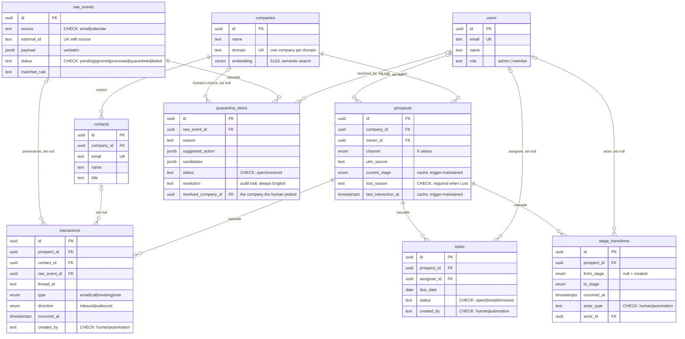

# YunoCRM

A CRM that fills itself from a raw event feed. Emails and calendar events are
stored verbatim, classified by rules, and turned into companies, prospects,
contacts and stage history. What the rules can't decide goes to a human queue.

Yuno take-home. Next.js 16 (App Router, React 19) · Postgres/Supabase ·
Drizzle · Tailwind 4 · Vitest · Recharts · Framer Motion · next-intl.
Live: [yuno-crm.vercel.app](https://yuno-crm.vercel.app).

## Contents

- [Quick start](#quick-start)
- [Keyboard shortcuts](#keyboard-shortcuts)
- [Tests](#tests)
- [Data model](#data-model)
- [Ingestion pipeline](#ingestion-pipeline)
- [Automations](#automations)
- [Where AI is used](#where-ai-is-used)
- [Real Gmail/Calendar integration](#real-gmailcalendar-integration)
- [With more time](#with-more-time)
- [Cut, and known limitations](#cut-and-known-limitations)

## Quick start

Needs Node 20+ (built on 24.18) and a free Supabase project. No Docker.

**1. Install**

```bash
git clone https://github.com/aicezhe/YunoCRM.git
cd YunoCRM
npm install
```

**2. Configure**

```bash
cp .env.example .env.local
```

All values come from one Supabase project:

| Variable | Where | Required |
| --- | --- | --- |
| `DATABASE_URL` | Settings → Database → Connection string (URI, port 5432) | yes |
| `NEXT_PUBLIC_SUPABASE_URL` | Settings → API → Project URL | yes |
| `NEXT_PUBLIC_SUPABASE_ANON_KEY` | Settings → API → anon public | yes |
| `SUPABASE_SERVICE_ROLE_KEY` | Settings → API → service_role | yes — creates auth accounts |
| `VOYAGE_API_KEY` | [dash.voyageai.com](https://dash.voyageai.com) | no — semantic search off without it |
| `ANTHROPIC_API_KEY` | [console.anthropic.com](https://console.anthropic.com) | no — quarantine AI tier skipped |

**3. Schema**

```bash
npx supabase login
npx supabase link --project-ref YOUR_PROJECT_REF
npx supabase db push
```

Ten migrations: 9 tables, 4 enums, CHECK constraints, 2 triggers, indexes,
`pg_trgm` and `vector`.

**4. Load data**

Fixture ships with the repo (`data/yuno-crm-seed-data.json`, 360 emails +
181 calendar events). Run in order; every script is idempotent:

```bash
npm run ingest            # JSON -> raw_events, verbatim
npm run classify          # processed / ignored / quarantined
npm run resolve           # -> companies, contacts, prospects, interactions, stages, tasks
npm run enrich            # suggestions for quarantined items
npm run embed-companies   # optional, needs VOYAGE_API_KEY
npm run seed-users        # auth accounts + roles
```

**5. Run**

```bash
npm run dev
```

<http://localhost:3000>. Five accounts, one password `YunoCRM2026!`
(a fixture, not a credential scheme):

| Email | Role |
| --- | --- |
| `giulia@yunoai.io` | admin |
| `marco@yunoai.io` | admin |
| `admin@yunoai.io` | admin |
| `sara@yunoai.io` | member |
| `luca@yunoai.io` | member |

`seed-users` upserts by email, so re-running it also resets roles changed in
the UI.

Result of a clean run, checked against the database:

| | |
| --- | --- |
| raw_events | 538 (357 email + 181 calendar) — 3 fewer than the JSON's 541, see duplicates |
| classified | 389 processed · 149 ignored · 5 quarantined |
| companies / prospects / contacts | 76 / 76 / 88 |
| interactions / stage_transitions | 396 / 259 |
| auto-created tasks | 40 |

## Keyboard shortcuts

| Shortcut | Does |
| --- | --- |
| `Shift`+`1` | Dashboard |
| `Shift`+`2` | Search |
| `Shift`+`3` | Quarantine |
| `Shift`+`4` | Team — admins only; does nothing for a member |
| `⌘`+`Shift`+`F` | On search: list all companies without typing |

Numbers come from the same `NAV_ITEMS` array the sidebar renders, so they
can't drift out of sync. Matching is on `event.code` (`Digit1`), not
`event.key` — the app ships in three languages and `Shift`+`1` isn't `!` on
every layout. Nothing fires while focus is in a text field, and
`Cmd`/`Ctrl`+digit is left to the browser. The sidebar shows each number on
hover.

## Tests

```bash
npm test          # 92 unit tests — no database, no network
npm run test:db   # 16 integration tests — needs DATABASE_URL + loaded fixture
npx tsc --noEmit
npm run build
```

`npm test` stays fast and secret-free so it works in CI:

| File | Tests | Covers |
| --- | --- | --- |
| `scripts/classification-rules.test.ts` | 21 | Each rule, plus priority order — `website_lead` (2) must beat `internal_email` (6) |
| `scripts/resolution-rules.test.ts` | 9 | Channel attribution, stage signals, lost reasons, reschedule vs cancellation |
| `scripts/embedding-rules.test.ts` | 11 | Text sent to the embedding model |
| `src/app/(app)/users/user-rules.test.ts` | 13 | Authorization: no self-promotion, last admin can't be demoted, unauthorized callers refused before existence is checked |
| `relative-time`, `format-days`, `typewriter-core`, `particle-field-core` | 38 | Locale formatting and animation maths |

Dashboard numbers are SQL, so reimplementing them in TypeScript would only
prove the copy agrees with itself. `npm run test:db` re-derives each figure a
different way (lateral ordered lookup where the query uses a window function,
separate counts where it uses filters) and compares.

That caught a real bug on its first run. Stage durations ordered only by
`occurred_at`, but 39 prospects have two transitions on the same timestamp —
so whichever sorted second absorbed the next stage's duration. Both queries
now order by `(occurred_at, to_stage)`; `funnel_stage` is a Postgres enum, so
it sorts in funnel order. Displayed averages didn't change — Postgres happened
to return the right order. Luck, not a guarantee.

Idempotency is checked by re-running: a second `ingest` reports
`inserted 0, skipped 541`, a second `resolve` creates 0 rows.

That check used to fail. Quarantine resolutions leave their raw event
`processed`, so the resolver picked them up again and matched by **sender
domain** — the exact inference those records exist to avoid. It created a
company named `libero.it` and moved two interactions onto it, one of which a
human had linked to `Autotrasporti Fumagalli`. `quarantine_items.resolved_company_id`
now stores the human's choice and the resolver reads it instead of guessing.

## Data model



**`companies` and `prospects` are separate.** A company exists once; a
prospect is one sales attempt at it. The same company can come back next
quarter through another channel — that's a second prospect with its own
funnel, not an overwrite. So channel, stage and owner live on `prospects`.
`companies.domain` is UNIQUE, which is what lets the resolver match a sender
domain to a company.

**`stage_transitions` is the source of truth, `current_stage` is a cache.**
Every change records from, to, when, by whom, human or automation. The cache
exists so the dashboard doesn't recompute history, and a **database trigger**
maintains it — no write path can forget. Same for `last_interaction_at`, whose
trigger only moves the timestamp forward, so a late old email can't rewind it.

**The database enforces integrity, not the app.** `lost_requires_reason` makes
a Lost prospect without a reason unrepresentable. `actor_type`, `created_by`
and every `status` are CHECK-constrained. `contacts.email` and
`companies.domain` are UNIQUE. `raw_events (source, external_id)` is UNIQUE —
that one line makes the pipeline replay-safe, and it already did work: the
fixture has **3 emails with duplicate `message_id`s** (360 in JSON, 357 in the
table).

**Deletes differ per relationship.** A company with prospects can't be deleted
(`restrict`). Deleting a prospect takes its interactions, history and tasks
(`cascade`). Deleting a user keeps the records they touched (`set null`) — the
history stays, it just loses the actor.

**`raw_events` is append-only and verbatim.** Rules change; the record of what
arrived shouldn't. Reclassifying is a re-run, not a re-import.

**`quarantine_items`** is the review queue: one row per undecidable event, with
reason and suggestions. `resolution` is stored in English regardless of UI
language — an audit trail shouldn't depend on someone's locale.
`resolved_company_id` is the machine-readable half, so a re-run can't overrule
a person.

**`tasks`** holds automation output that needs a human, with `created_by`
separating it from anything a person adds.

**Every index is tied to a named query**, documented inline in
`supabase/migrations/20260727200006_indexes.sql`: `current_stage` for the
by-stage dashboard, `last_interaction_at` for the withering scan,
`(prospect_id, occurred_at)` for timelines, `raw_events.status` for the next
ingest batch, `(assignee_id, status)` for "my open tasks", GIN trigram on
`companies.name` for search. At the brief's scale each is an index scan.

**No RLS.** All database access goes through the Next.js server over
`DATABASE_URL`; the browser only talks to Supabase Auth. Authorization is
server-side twice: middleware gates routes, and admin-only server actions
re-check the caller's role — a redirect alone wouldn't stop a member POSTing
to the action directly. RLS would matter the day the browser gets a direct
database connection.

## Ingestion pipeline

```
data/yuno-crm-seed-data.json
        │  ingest — verbatim, UNIQUE(source, external_id)
        ▼
   raw_events ──── classify ────┬── ignored     149  (internal, bulk, auto-reply, recruiting)
   (538 rows)   first match wins ├── processed   389 ──── resolve ──▶ companies · prospects
                                 │                                     contacts · interactions
                                 └── quarantined   5 ──── enrich ──▶ human review queue
```

### Content over sender

The obvious filter is by sender: drop `@yunoai.io`, keep the rest. On this
data that destroys the most valuable records in the file.

28 emails come from the company's own domain. Twenty are from
`noreply@yunoai.io` and are **website lead notifications** — a template
carrying `Nome:`, `Email:`, `Azienda:`, `Messaggio:`, `UTM source:`. They're
the only record of twenty inbound leads and the entire `website` channel. The
other 8 are real internal mail.

So classification keys on message content, not sender. `website_lead` sits at
priority 2, above `internal_email` at 6. A sender rule would have thrown away
20 of those 28 — 71% of what it filtered would have been real pipeline. Two
tests exist to stop a future edit from "tidying up" that order.

### Rules, first match wins

| # | Rule | Outcome | Signal | Matched |
| --- | --- | --- | --- | --- |
| 1 | `duplicate` | ignored | Already-seen `(source, external_id)` | 0 — the UNIQUE constraint gets there first |
| 2 | `website_lead` | processed | Lead template in the body | 20 |
| 3 | `auto_reply` | ignored | Subject starts `Risposta automatica:` | 6 |
| 4 | `external_bulk` | ignored | `noreply`/`newsletter`/`events`/`billing`/`notifications` | 27 |
| 5 | `recruiting` | ignored | Careers/hiring accounts | 3 |
| 6 | `internal_email` | ignored | Sender and all recipients `@yunoai.io` | 8 |
| 7 | `internal_event` | ignored | Calendar event with no external attendee | 96 |
| 8 | `cancelled_event` | ignored | Cancelled; a later same-company Demo/Check-in makes it a **reschedule** | 7 |
| 9 | `known_contact` | processed | Sender is an existing contact | 0 on a cold run |
| 10 | `known_domain` | processed | Sender domain is an existing company | 0 on a cold run |
| 11 | `personal_domain` | quarantined | gmail / libero / outlook — a person, not a company | 4 |
| 12 | `default_processed` | processed | Not noise ⇒ legitimate correspondence | 366 |
| 13 | `unresolved` | quarantined | Undecidable | 1 |

`noreply@` is in the bulk list at #4 and would have caught the lead
notifications — priority is what saves them, which is why tests assert it.

Rules 9 and 10 only fire once companies exist, so on a cold run every external
email would fall through to `unresolved` and flood the queue.
`default_processed` keeps quarantine an exception rather than the default.

### Three outcomes

**Ignored** is a decision, not a deletion — the row stays with the rule that
matched it, so any filtering choice can be audited or reversed by re-running.

**Processed** goes to the resolver: match or create the company by domain,
create contacts, open a prospect, write interactions and transitions.

**Quarantined** means the automation refused to guess — 5 of 538, under 1%. A
queue that gets a third of the traffic is just a second inbox and gets
ignored. Each item arrives with a reason, a suggested action and candidate
companies, so resolving is one click (create / link / discard). In the
deployed demo all 5 have been resolved, so the queue reads empty and the
**Resolved** tab shows what was decided, by whom, when. A fresh run leaves all
five open.

`personal_domain` is the interesting case. `cristina.ricci@libero.it` can't be
attributed by domain — `libero.it` is a consumer mailbox. Guessing corrupts
the pipeline, dropping loses a lead. So it goes to a human with fuzzy-matched
candidates attached.

## Automations

All three run inside `npm run resolve` and are marked
`actor_type = 'automation'` / `created_by = 'automation'`, so machine actions
are always distinguishable from human ones.

- **Stage advancement.** Email bodies and calendar events carry signals — demo
  booked, trial started, contract sent, explicit loss. Each writes a
  `stage_transitions` row and the trigger updates the cache. 259 transitions.
  A prospect moved to `Lost` without a canonical reason violates a CHECK.
- **Reschedule detection.** A cancelled event isn't a lost deal if the same
  company has a later Demo or Check-in. 7 cancellations were read as
  reschedules instead of pushing 7 live deals to Lost.
- **Follow-up tasks.** No reply for 7 days creates an open task for the Yuno
  employee on the thread — 40 created. Re-running doesn't duplicate: it keys on
  `(prospect_id, "no reply in 7 days")`.

## Where AI is used

**Not for classification.** Every routing decision above is a deterministic
rule:

- **Determinism** — the same email must classify the same way every time. A
  model that reclassifies `noreply@yunoai.io` differently on Tuesday reshapes
  the funnel and nobody notices until the numbers are wrong.
- **Testability** — 21 assertions against real rows in 71 ms, no network. A
  prompt can't be pinned that way.
- **Auditability** — `raw_events.matched_rule` records which rule decided, by
  name. "The model decided" isn't an answer a sales team can act on.

It's also cheaper: no API call, no rate limit, no half-classified inbox.

**Used for quarantine suggestions**, in two tiers, and only after the rules
admit they can't decide:

1. **`pg_trgm` word similarity** against `companies.name`, in Postgres. A
   confident match attaches candidates and the item never reaches the AI.
2. **Claude Haiku (`claude-haiku-4-5`)** for what tier 1 missed — reads the
   body to propose a company name and action.

This layer only writes `suggested_action` and `candidates`. Without
`ANTHROPIC_API_KEY` tier 2 is skipped; if the API fails, items are left bare.
Nothing downstream depends on it, and a human still clicks create / link /
discard.

**Used for semantic search.** Companies are embedded with Voyage
(`voyage-3-lite`, 512d) and search compares by cosine distance. That's how the
Russian query *винодельня* finds *Vini Colline Toscane* — 0.566 against 0.369
for the next closest. Without `VOYAGE_API_KEY` the screen says so and exact
matching still works.

One deliberate absence: the vector index. An IVFFlat index was created and then
**dropped** (migration `20260730090000`). At 76 rows with `lists = 100` most
k-means cells are empty, so a query whose nearest centroid owns an empty cell
matches nothing — measured with `enable_seqscan = off`: 20 of 20 random
vectors returned 0 rows. A sequential scan over 76 rows is exact and faster.
The index earns its place at tens of thousands of rows.

## Real Gmail/Calendar integration

Swapping the fixture for live sources changes the feeder, not the model.
`ingest.ts` is the only file that knows the JSON shape; everything downstream
reads `raw_events`. A Gmail adapter writing the same rows is a drop-in
replacement.

**OAuth.** Per-workspace, `gmail.readonly` and `calendar.events.readonly` —
read-only, since nothing here needs to send on a user's behalf. Refresh tokens
stay server-side, encrypted, one grant per mailbox.

**Incremental sync.**
- *Gmail*: `users.watch` registers a Pub/Sub channel; each notification carries
  a `historyId`. The worker calls `history.list` from the stored cursor and
  writes one row per message, `external_id` = Gmail message id.
- *Calendar*: `events.watch` plus `syncToken`s. `external_id` is the event id
  **plus a version discriminator**, so a reschedule arrives as a new row — the
  reschedule-vs-cancellation rule needs both events visible.

**Webhook plus polling.** Push is the optimization, polling is the guarantee.
Watch channels expire (~7 days for Gmail) and Pub/Sub can drop messages. A
scheduled poll on the same cursors produces identical rows, and idempotent
ingestion makes the overlap free. A lead lost to an expired channel is
invisible until someone asks why the pipeline went quiet.

**Duplicates are solved.** `UNIQUE(source, external_id)` plus
`onConflictDoNothing`: a webhook delivered twice, a replayed batch, or a
backfill overlapping live traffic all insert once. The fixture already proved
it with 3 duplicate `message_id`s.

**Errors.** `raw_events.status` is a state machine:
`pending → processed | ignored | quarantined | failed`. Transient failures mark
`failed` and are retryable by re-running the classifier — the payload is stored,
so a retry costs no API call. Permanent failures stay `failed` with the error
recorded. Rate limits get exponential backoff on the fetch side, before any
write.

**LLM parsing for unstructured mail.** The fixture's leads use a fixed template
a regex handles. Real inboxes don't cooperate — prose, two languages, company
name in a signature. Keep the regex as the fast path and fall back to an LLM
extraction pass (company, contact, intent, action + confidence) when it
doesn't match. Two rules keep that safe: the output is a *proposal* written to
`suggested_action`, not applied; anything below the confidence threshold goes
to a human. Extraction is where a model earns its keep. Routing isn't.

**Where the human sits.** Quarantine already is this loop, running on the
`personal_domain` and `unresolved` cases. Under 1% of traffic keeps it a real
workflow. If a live feed pushed it past a few percent, the fix is the rules,
not a bigger queue.

## With more time

- **Predictive churn instead of a fixed threshold.** "Cold after 14 days"
  treats a 3-day-old enterprise negotiation and a 3-day-old inbound lead the
  same. With enough closed history, estimate probability of loss from features
  already in the schema — stage, channel, time in stage, cadence, direction
  ratio — and rank by value at risk. Thresholds would be per-segment: 14 days
  of silence means something different for `website` than for
  `linkedin_outbound`.
- **A cross-company task list.** The 40 tasks are created and shown in context
  (company page, search overlay) with title, due date and assignee. Missing is
  one "my open tasks" screen across all companies. The brief asks for tasks to
  be created, not for that screen, so it's an addition rather than a gap —
  `idx_tasks_assignee_status` already exists for it.
- **Ingestion as a service.** Six idempotent CLI scripts today; production
  needs a queue-backed worker with retries and a dead-letter path. The
  `raw_events.status` state machine is already the right shape.
- **A fixture database for the SQL tests.** `npm run test:db` runs against the
  app's own database. The right version spins up a disposable Postgres with a
  small hand-built fixture, so tests are hermetic and can assert exact numbers.
- **Realtime.** Supabase Realtime on `quarantine_items` would keep the queue
  live; today two people can pick up the same item.

## Cut, and known limitations

- **Ownership graph — cut for lack of honest data.** The brief hints at who
  owns which relationship. The dataset only says who appears on a thread, which
  isn't the same: the person sending the most email may be doing the least
  valuable work. That view would have been the most impressive thing here and
  the least true, so `owner_id` records the assignee and nothing extrapolates.
- **No manual prospect or stage editing.** Records enter through the pipeline
  or quarantine resolution. Matches the thesis — a CRM that fills itself — but
  a real deployment needs it. `actor_type = 'human'` is already there.
- **The segment drawer caps at 200 rows** and says so in its footer.
- **The dataset is static, and the withering screen shows it.** The fixture
  ends 9 July 2026, so against today every prospect reads as cold. "Cold",
  "days per stage" and stage timings are anchored to the newest event *in the
  data*, and that anchor date is printed under the dashboard greeting. Recent
  Activity is the one place using the real clock — it answers "what happened
  lately" and would be lying otherwise.
- **54 of 57 open prospects are withering, and that's correct.** The 393
  interactions spread evenly over six months with only 16 in the last
  fortnight, so a 14-day window covers ~8% of the history. An even spread
  predicts 4–5 warm; there are 3. The threshold is the brief's and was left
  alone rather than tuned for a friendlier screenshot.
- **The UI ships in English, Italian and Russian.** Beyond the brief, added as
  a production-readiness demo — and it surfaced real bugs worth keeping
  (gender agreement in generated phrases; the Russian rule that a fractional
  quantity takes the genitive singular — *13,7 дня*, not *13,7 дней*).

`DECISIONS.md`, cited in the pipeline code by section (§1–§8), is the brief's
own document and isn't vendored here.
